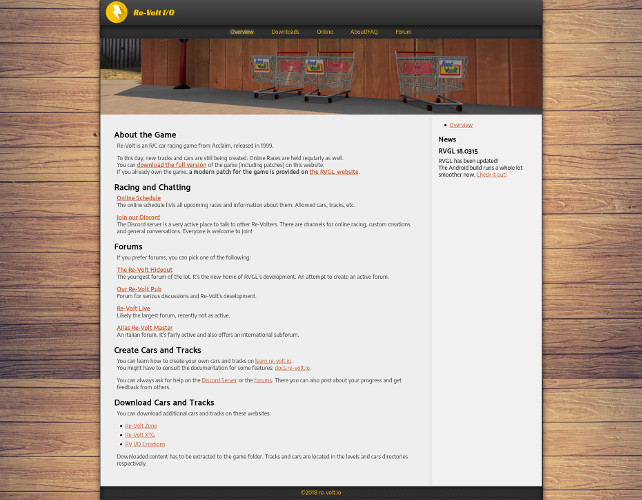

# Bolt (Grav theme)
A simple theme for GRAV that utilizes css grids and variables.

Warning: This theme requires a very specific setup and it might not be suited for your needs. I wrote this theme for my own website.  
Check my [demo repo](https://github.com/Yethiel/grav-theme-bolt-demo) for a possible setup.

## Features

- Pure HTML and CSS
- Different templates:
    - Default
    - Blog
    - Post
    - Columns
    - Gallery
    - Chapter
    - Docs
- Dropdown menus
- A configurable sidebar (can be customized in the page layout settings from the admin panel).
- A breakpoint at 800px that enables the mobile layout.

**Demo**: [test.re-volt.io](https://test.re-volt.io/)

## Documentation

### Page Templates

All page templates contain a sidebar. Its position can be set in the Layout Settings (see further below).

#### Default
The default layout displays page contents normally.

#### Blog
This template displays its children via the Pagination plugin.

#### Post
This template is for blog posts. It displays the page title and the date.

#### Columns
Divides the page content at horizontal lines `---` and displays it in columns. Their width can be set in the Layout Settings.

#### Gallery
Similarly to the Columns template, it divides the page content at horizontal lines and displays the segments as gallery entries.

#### Chapter
Insipred by the Learn2 Chapter layout. It displays a large heading and a table of child pages.

#### Docs
Also inspired by Learn2. Displays the site title as a large heading with a horizontal line. Otherwise similar to Default.

### Layout Settings

The layout settings can be set per-page in the Grav admin panel. Look out for the new _Layout Settings_ tab in the page editor.  
Nearly all settings have a `global` option that can be set in the theme settings, per-template.

#### Sidebar Layout
Select the sidebar location. The options including the showcase will enable a box with a ranom picture from the page folder.

#### Sidebar Content
In addition to the child pages of the current site, you can also display another page's contents in the sidebar.
Provide the path to the page, e.g. `/downloads/more/`.

#### Showcase
Enable or disable the showcase.

#### Table of Contents
Show or hide the table of child pages in the sidebar.

#### Horizontal Table of Contents
Display the table horizontally rather than as a list. This is useful for the horizontal sidebar layouts.

### Customization

The `custom.css` file in `user/themes/bolt/css/` can be enabled in the theme settings and can be used to alter the style of the theme.  
`variables.css` contains link and text colors as well as some dimensions for the grid layout.  
`style.css` contains most of the style.

The sidebar layouts can be customized in the `user/themes/bolt/css/layouts` folder.

The favicon and the page background reside in `user/themes/bolt/images`.  
You can updload your own images there and set them in the theme settings.

### Plugins

Supported/required Grav plugins:
- Breadcrumbs
- Pagination
- TNT Search
- Toc